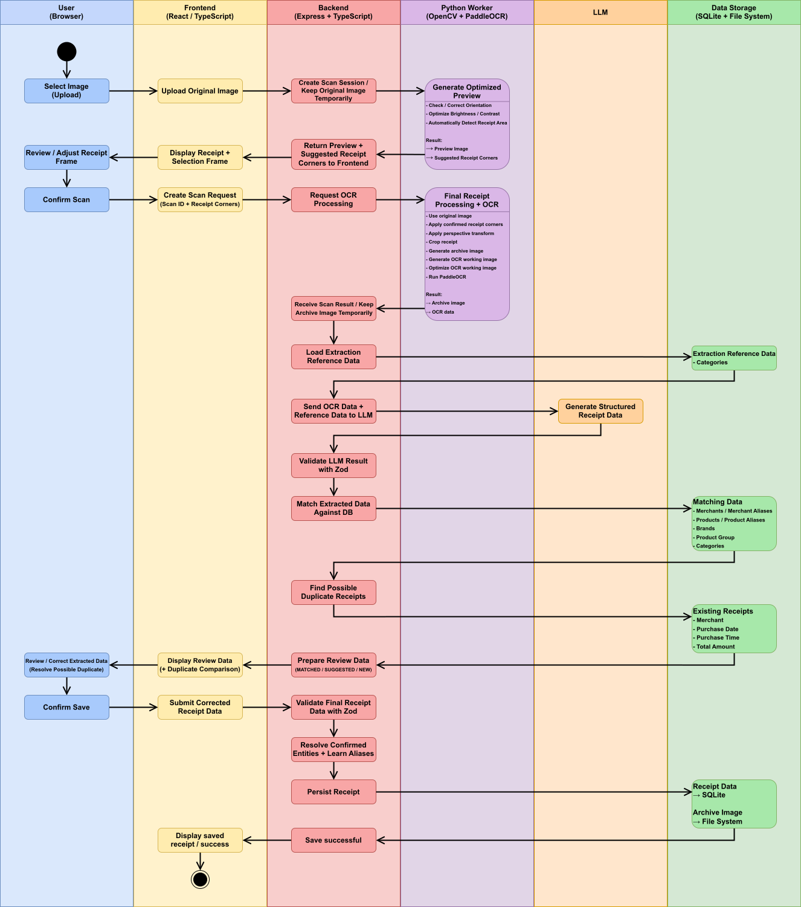
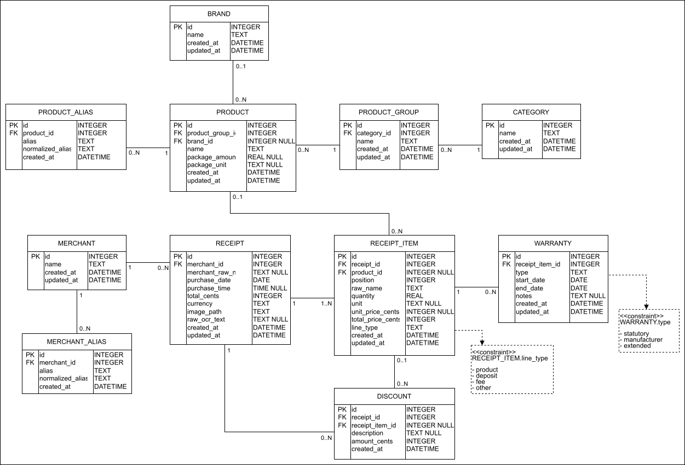

# Receipt Tracker

> This project is my upcoming final project for a software development bootcamp. Development is scheduled to begin on September 28, 2026.

Receipt Tracker is an application for digitizing, organizing, and analyzing receipts.

Users can import a receipt image, adjust the detected receipt area, extract its contents using OCR, and review structured data generated with the help of an LLM. Products and merchants are matched against a database so that previously confirmed receipt labels can be recognized automatically in future imports.

The application keeps the user involved in the import process by allowing uncertain matches and newly detected products to be reviewed before they are stored.

## Planned Features

### Receipt Processing

- Receipt image upload
- Automatic receipt detection with manual corner adjustment
- Perspective correction and image preprocessing
- OCR-based receipt extraction
- LLM-assisted structuring and normalization
- Merchant and product matching
- Detection of possible duplicate receipts
- Learning recurring receipt labels through aliases

### Receipt Management

- Manual review and correction before saving
- Receipt overview and detail views
- Product and merchant search
- German and English user interface
- Warranty and statutory warranty tracking

### Analysis

- Product price history
- Price comparisons
- Expense statistics
- Category-based analysis
- Merchant-based analysis

## Technical Overview

### Frontend

- React
- TypeScript
- Tailwind CSS
- react-i18next

### Backend

- Node.js
- Express
- TypeScript
- Zod
- Drizzle ORM

### Image Processing & OCR

- Python
- OpenCV
- PaddleOCR

### AI

- LLM integration via Ollama
- Support for external LLM providers via API key

### Storage

- SQLite
- Filesystem

## Import Workflow

The following activity diagram shows the receipt import process, from image upload and preprocessing to OCR, LLM-based data extraction, database matching, user validation, and persistent storage.



## Database Model

The database separates receipts, receipt items, products, merchants, aliases, categories, discounts, and warranty information.

Aliases allow the application to learn confirmed receipt labels over time and automatically recognize previously encountered products and merchants.



## Project Status

The project is currently in the planning phase. Development is scheduled to begin on September 28, 2026.

The first development phase focuses on implementing the complete vertical receipt import workflow:

```text
Image Upload
    ↓
Receipt Preview & Adjustment
    ↓
Image Processing
    ↓
OCR
    ↓
LLM Extraction
    ↓
Database Matching
    ↓
Duplicate Detection
    ↓
User Review
    ↓
Persistent Storage
```

## License

This project is licensed under the MIT License. See the [LICENSE](LICENSE) file for details.
