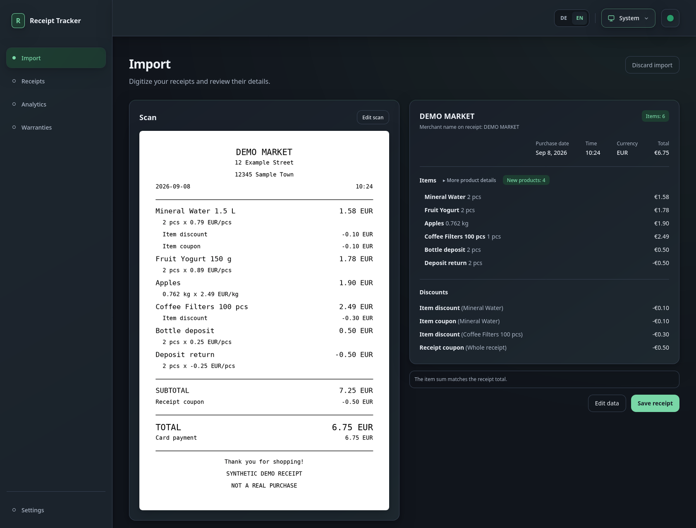
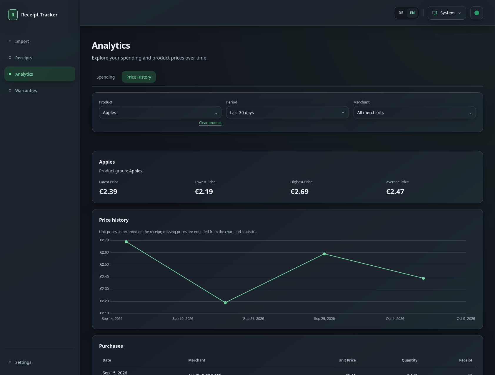

# Receipt Tracker

Receipt Tracker is an application for digitizing, organizing and analyzing shopping receipts. It reads receipt photos using OCR and an LLM, then turns the extracted text into structured data about merchants, purchases, products and discounts. Users can review and correct the results before saving them together with the receipt image.

The saved receipts form a searchable archive for tracking spending and following product prices over time. Warranty periods can be recorded manually for individual purchases and viewed in a separate overview. Merchant and product aliases help recognize previously confirmed receipt labels in future imports.

This application is my final project for a software development bootcamp.



## Features

- Receipt import with automatic detection, OCR and LLM-based extraction
- Manual review, merchant and product matching, and duplicate detection
- Searchable receipt archive
- Spending analytics and product price history
- Overview of manually recorded warranty periods
- German and English UI with light/dark themes and accent colors

Spending analytics covers selectable periods with an optional merchant filter. Product price history shows unit prices from saved receipts.



Both screenshots use synthetic demo data.

## How it works

Upload a receipt image, check the suggested frame and orientation, and adjust them if needed. Select an AI provider and process the receipt. OCR reads the text, the LLM structures it, and the application matches merchants and products against known records. Review and correct the data before saving; possible duplicates require confirmation.

Confirmed receipt labels can be learned as aliases for future imports. Warranty periods are entered manually and are not generated by the LLM.


## Technology

The frontend uses React, TypeScript, Vite and Tailwind CSS. The backend runs on Node.js with Express, Drizzle and SQLite. A Python worker handles image processing and OCR with OpenCV and PaddleOCR. Receipt extraction uses OpenAI or Ollama, and receipt images are stored on the local filesystem.

Receipts reference merchants and products, while aliases allow confirmed labels to be recognized in future imports. The diagram shows the receipt domain, including discounts and warranty periods; AI settings are stored separately.


## Getting started

Requires Node.js 24, npm and Python 3.12. The following setup assumes Linux.

**1. Clone the repository and install Node.js dependencies.**

```bash
git clone https://github.com/codemorra/receipt-tracker.git
cd receipt-tracker
npm ci
npm --prefix frontend ci
npm --prefix backend ci
```

**2. Set up the Python worker.**

```bash
python3.12 -m venv python_worker/.venv
source python_worker/.venv/bin/activate
python -m pip install -r python_worker/requirements.txt
paddleocr install_hpi_deps cpu
```

See the [worker README](python_worker/README.md) for worker details and tests. OCR models are downloaded on first initialization.

**3. Start the backend.**

```bash
npm run dev:backend
```

The backend applies database migrations and starts the Python worker automatically. Infrastructure settings are optional; see [backend/.env.example](backend/.env.example). To override them, copy it to `backend/.env` and edit the needed values.

**4. Start the frontend in another terminal.**

```bash
npm run dev:frontend
```

Open `http://localhost:5173`. The frontend proxies API requests to port 3000; changing the backend port also requires updating [frontend/vite.config.ts](frontend/vite.config.ts).

**5. Configure an AI provider in Settings** as described below, then import a receipt.

For sample imports, use the five [synthetic demo receipts](docs/demo-receipts/). To make your own, edit the example data in the [receipt generator](scripts/generate-demo-receipts.py) and run it from the repository root:

```bash
python_worker/.venv/bin/python scripts/generate-demo-receipts.py
```

This creates `demo-receipt.png`; use `--output` to choose another path.

## AI providers

Receipt extraction is currently tuned for OpenAI `gpt-6-luna` and `qwen3.8:27b` via Ollama. Based on experience with this project, Luna is the recommended option for its balance of extraction quality and processing speed. Qwen provides a fully local alternative but typically requires more manual correction.

Open **Settings**, choose **Add provider**, configure and enable it, then select a default:

- **OpenAI:** API key and model (`gpt-6-luna`).
- **Ollama:** local base URL (initially `http://127.0.0.1:11434`) and model (`qwen3.8:27b`). Start Ollama and download the model with `ollama pull qwen3.8:27b` before importing.

Providers start unconfigured. Settings saved in SQLite control provider configuration at runtime; provider environment variables are not used. A provider can also be selected per import. There is no automatic provider fallback.

API keys are stored encrypted in the SQLite database; the master key is stored separately on the local filesystem. Back up both the database and master key to preserve access to saved API keys. The master key location is documented in [backend/.env.example](backend/.env.example).

## Current limitations

- Extracted data can be incorrect; user review remains necessary.
- Saved receipts are read-only and cannot currently be edited or deleted.
- The application is intended for local, single-user use and has no authentication.
- Linux is the tested development platform; Windows and macOS are unverified.

## Future work

Future development may focus on extraction quality, editing and managing stored data, and additional analytics.

## License

This project is licensed under the MIT License. See the [LICENSE](LICENSE) file for details.
