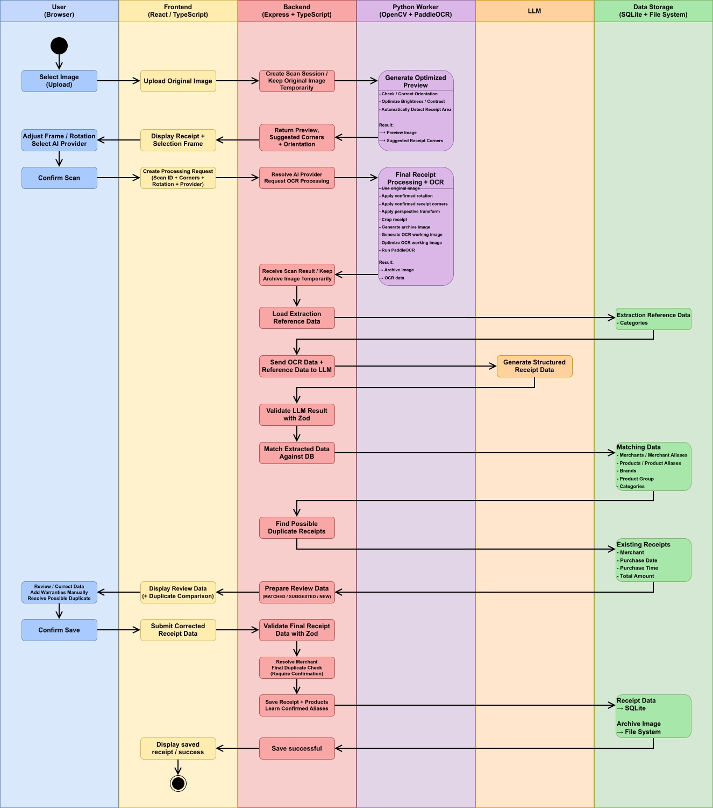
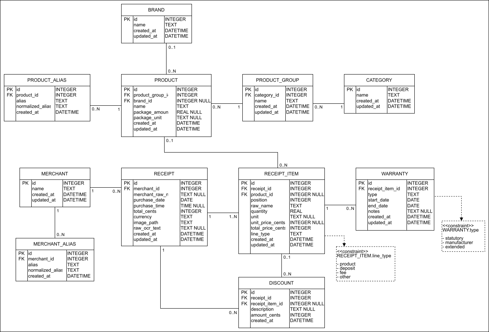

# Receipt Tracker

> This project is my final project for a software development bootcamp and is currently under active development.

Receipt Tracker is an application for digitizing, organizing, and analyzing receipts.

Users can import a receipt image, adjust the detected receipt area, extract its contents using OCR, and review structured data generated with the help of an LLM. Products and merchants are matched against a database so that previously confirmed receipt labels can be recognized automatically in future imports.

The application keeps the user involved in the import process by allowing uncertain matches and newly detected products to be reviewed before they are stored.

## Features

### Receipt Processing

- Receipt image upload
- Automatic receipt detection with manual corner adjustment
- Perspective correction and image preprocessing
- OCR-based receipt extraction
- LLM-assisted structuring and normalization
- Merchant and product matching
- Manual review and correction of receipt data, items, discounts, and matches
- Detection and comparison of possible duplicate receipts
- Learning recurring merchant and product labels through aliases
- Manual warranty information for individual receipt items
- Persistent storage of processed receipts and receipt images
- German and English user interface

### Planned Receipt Management & Analysis

- Receipt overview and navigation to saved receipts
- General search and filtering
- Product and merchant browsing
- Product price history
- Price comparisons
- Expense statistics
- Category-based analysis
- Merchant-based analysis
- Dedicated warranty overview

## Technical Overview

### Frontend

- React
- TypeScript
- Vite
- Tailwind CSS
- react-i18next

### Backend

- Node.js
- Express
- TypeScript
- Zod
- Drizzle ORM

### Image Processing & OCR

- Python 3.12
- OpenCV
- Pillow
- PaddleOCR

### AI

- Local LLM integration via Ollama
- Mistral API
- OpenAI Responses API
- Shared receipt extraction prompt and structured JSON output

The currently tested model configurations are:

- Ollama / `qwen3.8:27b`
- Mistral / `mistral-medium-latest`
- OpenAI / `gpt-6-luna`

### Storage

- SQLite
- Filesystem

## Getting Started

Requires Node.js 22.12 or newer, npm, and Python 3.12.

### Clone the repository

```bash
git clone https://github.com/codemorra/receipt-tracker.git
cd receipt-tracker
```

### Install Node.js dependencies

```bash
npm ci
npm --prefix frontend ci
npm --prefix backend ci
```

### Set up the Python worker

```bash
python3.12 -m venv python_worker/.venv
source python_worker/.venv/bin/activate
python -m pip install -r python_worker/requirements.txt
paddleocr install_hpi_deps cpu
```

The backend starts and manages the Python worker automatically during normal development.

For more details, see [python_worker/README.md](python_worker/README.md).

### Configure the environment

Create the backend environment file:

```bash
cp backend/.env.example backend/.env
```

Choose one LLM provider in `backend/.env`.

For local Ollama:

```dotenv
LLM_PROVIDER=ollama
OLLAMA_MODEL=qwen3.8:27b
OLLAMA_BASE_URL=http://127.0.0.1:11434
```

Make sure Ollama is installed and running, and pull the configured model if necessary:

```bash
ollama pull qwen3.8:27b
```

For Mistral:

```dotenv
LLM_PROVIDER=mistral
MISTRAL_MODEL=mistral-medium-latest
MISTRAL_API_KEY=your-mistral-api-key
```

For OpenAI:

```dotenv
LLM_PROVIDER=openai
OPENAI_MODEL=gpt-6-luna
OPENAI_API_KEY=your-openai-api-key
```

Other useful variables include:

- `PORT` — backend port, default `3000`
- `PYTHON_EXECUTABLE` — custom Python executable path if the default worker virtual environment is not used

API keys are backend-only and must not be committed. See [backend/.env.example](backend/.env.example) for the current configuration template.

### Start the backend

```bash
npm run dev:backend
```

The backend applies database migrations and starts the Python worker automatically.

### Start the frontend

In another terminal:

```bash
npm run dev:frontend
```

Vite normally serves the frontend on `http://localhost:5173` and proxies `/api` to the backend on port `3000`.

## LLM Providers and Runtime Example

Receipt extraction currently uses the same core receipt prompt and schema across the supported providers, with small model-specific settings where needed.

The following measurements are single example runs using the same receipt with 17 positions, 18 discounts, a deposit charge, and a deposit return.

| Model                   | Provider | LLM / API |    Total |
| ----------------------- | -------- | --------: | -------: |
| `qwen3.8:27b`           | Ollama   |   95.52 s |  97.34 s |
| `mistral-medium-latest` | Mistral  |  102.02 s | 103.77 s |
| `gpt-6-luna`            | OpenAI   |   13.20 s |  14.94 s |

All three models produced correct core extraction results for this example receipt.

The Qwen run was executed locally on an AMD Radeon RX 7900 XTX. Cloud timings depend on provider and network load. These values are example measurements from one receipt and one run per model, not general model benchmarks.

The three configurations are currently used as practical reference points for receipt extraction. All tested models still show occasional extraction issues on some receipts, so further optimization is needed. Future tuning is expected to focus primarily on Luna, while user review remains important regardless of the selected provider.

## Import Workflow

The following activity diagram shows the receipt import process, from image upload and preprocessing to OCR, LLM-based data extraction, database matching, user validation, and persistent storage.



The current workflow is:

```text
Image Upload
    ↓
Receipt Preview & Adjustment
    ↓
Image Processing
    ↓
OCR
    ↓
LLM Extraction
    ↓
Database Matching
    ↓
Duplicate Detection
    ↓
User Review
    ↓
Persistent Storage
```

## Database Model

The database separates receipts, receipt items, products, merchants, aliases, categories, discounts, and warranty information.

Aliases allow the application to learn confirmed receipt labels over time and automatically recognize previously encountered products and merchants.



## Project Status

The core receipt import, review, duplicate-check, and save workflow is implemented, including direct loading of a saved receipt by its ID.

The new frontend shell provides responsive navigation, language and appearance controls, and placeholder pages. The original import interface is retained as a legacy reference until the new import UI is implemented.

The next development phase focuses mainly on frontend, receipt management, and analysis features, including:

- Receipt overview and search/filtering
- Product and merchant browsing
- Product price history and comparisons
- Expense statistics
- Category- and merchant-based analysis
- Warranty overview

The project is still under active development and is not production-ready.

## License

This project is licensed under the MIT License. See the [LICENSE](LICENSE) file for details.
